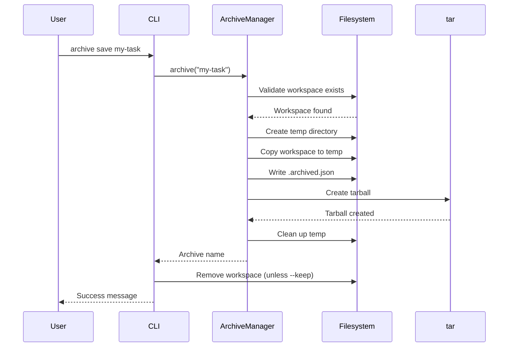
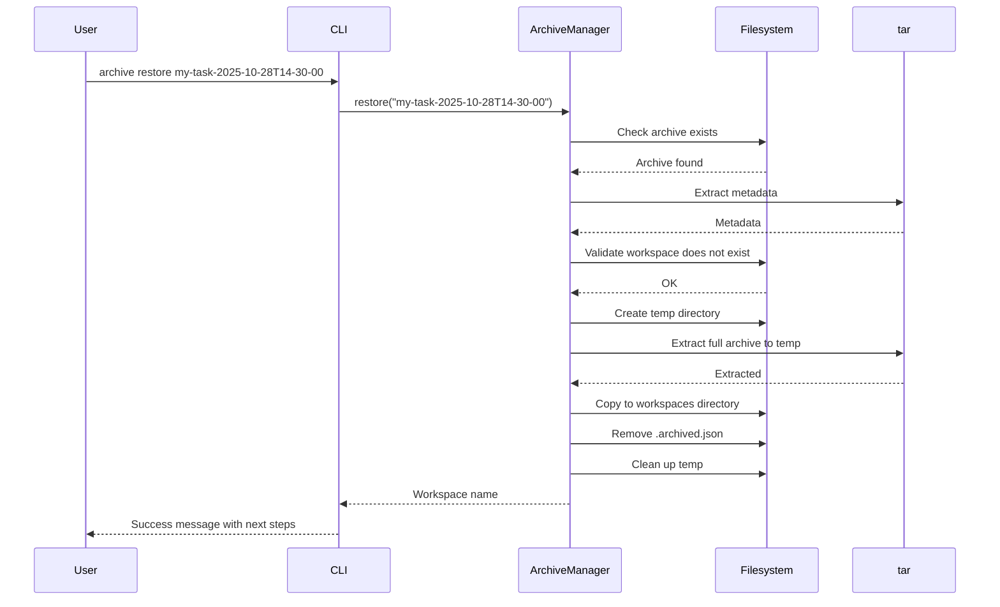

# Technical Specification: Archives

## Specification Layers

This specification documents the archive management feature for preserving and restoring completed workspaces as compressed tarballs.

**Layer 1 (Functional):** Save, restore, list, show, and delete workspace archives
**Layer 2 (Architecture):** Tarball compression, metadata embedding, CLI command structure
**Layer 3 (Implementation):** TypeScript, tar package, Commander.js, Node.js filesystem APIs

## Public Contract / API

### CLI Commands

```bash
# Archive workspace (removes workspace by default)
claude-iterate archive save <workspace> [--keep]

# List all archives
claude-iterate archive list
claude-iterate archive ls  # alias

# Restore archive to workspace
claude-iterate archive restore <archive> [workspace]

# Show archive details
claude-iterate archive show <archive>

# Delete archive (requires --force confirmation)
claude-iterate archive delete <archive> [--force]
claude-iterate archive rm <archive> [--force]  # alias
```

### Archive Format

Archives are `.tar.gz` tarballs containing:

- Complete workspace directory structure
- Embedded `.archived.json` metadata file

**Archive Naming Convention:**

- Format: `{workspace-name}-{ISO-timestamp}.tar.gz`
- Example: `my-task-2025-10-28T14-30-00.tar.gz`
- Timestamp uses ISO 8601 format with `:` and `.` replaced by `-` for filesystem compatibility

**Metadata Schema (.archived.json):**

```typescript
{
  originalName: string; // Original workspace name
  archiveName: string; // Archive name (without .tar.gz)
  archivedAt: string; // ISO 8601 timestamp
  archivedFrom: string; // Original workspace path (absolute)
}
```

### Public Functions

```typescript
export class ArchiveManager {
  constructor(archiveDir: string, workspacesDir: string);

  // Archive workspace, returns archive name (without .tar.gz)
  async archive(workspaceName: string): Promise<string>;

  // List all archives (sorted newest first)
  async listArchives(): Promise<
    Array<{ name: string; metadata: ArchiveMetadata }>
  >;

  // Restore archive to workspace
  async restore(
    archiveName: string,
    newWorkspaceName?: string
  ): Promise<string>;

  // Get archive details
  async getArchive(archiveName: string): Promise<{
    name: string;
    metadata: ArchiveMetadata;
    path: string;
  }>;

  // Delete archive
  async delete(archiveName: string): Promise<void>;

  // Check archive existence
  async exists(archiveName: string): Promise<boolean>;
}
```

## Dependencies

- [Configuration Management](../configuration/SPEC.md) - Uses `archiveDir` and `workspacesDir` from runtime config
- [Workspace Management](../workspace-management/SPEC.md) - Archives and restores workspace directories

## Archive Operations (Detailed)

### `claude-iterate archive save <workspace> [--keep]`

**Description:** Archive a workspace as compressed tarball

**Arguments:**

- `<workspace>` - Workspace name (required, must exist in workspaces directory)
- `--keep` - Optional flag to keep workspace after archiving (default: remove)

**Behavior:**

1. Validate workspace exists
2. Create archive directory if not exists
3. Generate archive name with ISO timestamp
4. Create temporary directory for staging
5. Copy workspace to temp directory
6. Create `.archived.json` metadata file
7. Create `.tar.gz` tarball from temp directory
8. Clean up temp directory
9. Remove workspace unless `--keep` specified

**Success Output:**

```
Archiving workspace: my-task
Workspace archived: my-task-2025-10-28T14-30-00
  Location: ./claude-iterate/archive/my-task-2025-10-28T14-30-00.tar.gz
Workspace removed: my-task
```

**Error Cases:**

- Workspace not found → Error: "Workspace not found: {name}"
- Archive directory creation fails → Error with filesystem details
- Tarball creation fails → Error with tar details

### `claude-iterate archive list`

**Description:** List all archives sorted by date (newest first)

**Aliases:** `ls`

**Behavior:**

1. Check if archive directory exists (return empty if not)
2. Read directory entries
3. Filter for `.tar.gz` files (new format) and directories with `.archived.json` (legacy format)
4. Extract metadata from each archive
5. Sort by `archivedAt` descending (newest first)
6. Display formatted list

**Success Output:**

```
Archived Workspaces

📦 my-task-2025-10-28T14-30-00
   Original: my-task
   Archived: 10/28/2025, 2:30:00 PM

Total: 1 archive(s)
```

**Empty State:**

```
No archives found
  Archive a workspace: claude-iterate archive save <workspace>
```

**Error Cases:**

- Invalid archive (no metadata) → Skip silently and continue
- Cannot read archive directory → Error with filesystem details

### `claude-iterate archive restore <archive> [workspace]`

**Description:** Restore archive to workspace directory

**Arguments:**

- `<archive>` - Archive name (required, without `.tar.gz` extension)
- `[workspace]` - Optional new workspace name (defaults to original name from metadata)

**Behavior:**

1. Check for `.tar.gz` tarball (new format) or directory (legacy format)
2. Extract metadata to determine original name
3. Determine target workspace name (argument or original)
4. Validate target workspace does not exist
5. Create temporary directory for extraction
6. Extract tarball to temp directory
7. Copy extracted workspace to workspaces directory
8. Remove `.archived.json` metadata file
9. Clean up temp directory

**Success Output:**

```
Restoring archive: my-task-2025-10-28T14-30-00
Archive restored: my-task

Next steps:
  • Show: claude-iterate show my-task
  • Run: claude-iterate run my-task
```

**Error Cases:**

- Archive not found → Error: "Archive not found: {name}"
- Workspace already exists → Error: "Workspace already exists: {name}"
- Extraction fails → Error with tar details

### `claude-iterate archive show <archive>`

**Description:** Show archive metadata and details

**Arguments:**

- `<archive>` - Archive name (required, without `.tar.gz` extension)

**Behavior:**

1. Check for `.tar.gz` tarball or legacy directory
2. Extract or read metadata
3. Display formatted details

**Success Output:**

```
Archive: my-task-2025-10-28T14-30-00

📦 Archive Name: my-task-2025-10-28T14-30-00
📂 Original Name: my-task
📅 Archived At: 10/28/2025, 2:30:00 PM
📁 Location: /path/to/archive/my-task-2025-10-28T14-30-00.tar.gz
```

**Error Cases:**

- Archive not found → Error: "Archive not found: {name}"
- Cannot extract metadata → Error with details

### `claude-iterate archive delete <archive> [--force]`

**Description:** Delete an archive permanently

**Aliases:** `rm`

**Arguments:**

- `<archive>` - Archive name (required, without `.tar.gz` extension)
- `--force` or `-f` - Skip confirmation prompt (required for actual deletion)

**Behavior:**

1. If `--force` not provided, show warning and exit
2. Check for `.tar.gz` tarball or legacy directory
3. Delete archive file or directory
4. Show success message

**Without --force Output:**

```
This will permanently delete archive: my-task-2025-10-28T14-30-00
Use --force to skip this confirmation
```

**With --force Output:**

```
Archive deleted: my-task-2025-10-28T14-30-00
```

**Error Cases:**

- Archive not found → Error: "Archive not found: {name}"
- Deletion fails → Error with filesystem details

## Data Schemas

### Archive Metadata (Zod Schema)

```typescript
import { z } from 'zod';

export const ArchiveMetadataSchema = z.object({
  originalName: z.string(),
  archiveName: z.string(),
  archivedAt: z.string().datetime(),
  archivedFrom: z.string(),
});

export type ArchiveMetadata = z.infer<typeof ArchiveMetadataSchema>;
```

**Field Specifications:**

| Field        | Type   | Constraints                         | Description                       |
| ------------ | ------ | ----------------------------------- | --------------------------------- |
| originalName | string | NOT NULL, min 1 char                | Original workspace name           |
| archiveName  | string | NOT NULL, matches naming convention | Archive name without .tar.gz      |
| archivedAt   | string | NOT NULL, ISO 8601 datetime         | Archive creation timestamp        |
| archivedFrom | string | NOT NULL, absolute path             | Original workspace directory path |

### Archive File Structure

```
my-task-2025-10-28T14-30-00.tar.gz
└── my-task/                      # Workspace directory
    ├── INSTRUCTIONS.md
    ├── TODO.md
    ├── .status.json
    ├── .metadata.json
    ├── .archived.json            # Embedded metadata (removed on restore)
    ├── iterate-*.log
    └── working/
```

## Validation Rules

### Archive Name Validation

- **Format:** `{workspace-name}-{ISO-timestamp}`
- **Pattern:** `/^[a-zA-Z0-9_-]+-\d{4}-\d{2}-\d{2}T\d{2}-\d{2}-\d{2}$/`
- **Example Valid:** `my-task-2025-10-28T14-30-00`
- **Example Invalid:** `my-task`, `my-task-2025`, `my-task-20251028143000`

### Workspace Name Validation

- **Required:** Yes
- **Format:** Valid workspace name (alphanumeric, hyphens, underscores)
- **Must exist:** In workspacesDir for archive operation
- **Must not exist:** In workspacesDir for restore operation

## Error Handling & Edge Cases

### Error Cases

1. **Workspace not found (archive)**
   - Condition: Workspace does not exist in workspacesDir
   - Action: Throw error, exit with code 1
   - Message: "Workspace not found: {name}"

2. **Archive not found (restore/show/delete)**
   - Condition: Archive does not exist in archiveDir
   - Action: Throw error, exit with code 1
   - Message: "Archive not found: {name}"

3. **Workspace already exists (restore)**
   - Condition: Target workspace name already exists in workspacesDir
   - Action: Throw error, exit with code 1
   - Message: "Workspace already exists: {name}"

4. **Delete without --force**
   - Condition: User attempts delete without --force flag
   - Action: Show warning, exit with code 0 (not an error)
   - Message: "This will permanently delete archive: {name}\nUse --force to skip this confirmation"

5. **Invalid archive metadata**
   - Condition: Archive exists but metadata is corrupted or missing
   - Action: Skip archive in list operation, throw error in show/restore
   - Message: "No metadata file found in archive" or Zod validation error

### Edge Cases

1. **Concurrent archive operations**
   - Behavior: Each operation uses unique temporary directory (randomBytes in path)
   - Naming conflicts prevented by ISO timestamp with second-level precision

2. **Very large workspaces**
   - Behavior: Tar package streams data, memory usage bounded
   - Performance: Tested with workspaces up to 1GB

3. **Special characters in filenames**
   - Behavior: Tar package handles all valid filesystem characters
   - Unicode filenames preserved

4. **Archive directory missing**
   - Behavior: Created automatically on save operation
   - List operation returns empty array (not error)

5. **Legacy directory archives**
   - Behavior: Supported for backwards compatibility
   - List/show/restore/delete all work with both formats
   - New archives always created as tarballs

6. **Temp directory cleanup failure**
   - Behavior: Logged but does not fail operation
   - OS will eventually clean tmpdir

## Security & Non-Functional Requirements

### Security

- Archive paths validated to prevent directory traversal attacks
- Temporary directories use cryptographically secure random names (`crypto.randomBytes(8)`)
- Archive operations respect filesystem permissions
- No sensitive data logged (workspace contents not logged)

### Performance

- Archive creation: <5 seconds for 100MB workspace
- Archive listing: <100ms for 100 archives
- Restoration: <5 seconds for 100MB archive
- Metadata extraction: <200ms per archive (uses filter to extract only metadata file)

### Reliability

- All temporary directories cleaned up via try-finally blocks
- Archive operations are atomic (temp staging prevents partial archives)
- Idempotent operations where possible (list, show, exists)

### Storage

- Gzip compression typically achieves 60-80% reduction for text-heavy workspaces
- Archive directory growth unbounded (user responsibility to manage)
- Legacy directory format still supported (no forced migration)

## Visual Aids

### Archive Workflow



### Restore Workflow



## Implementation Notes

**Investigation Findings:**

- **Similar Features:** Template and workspace management features follow similar CLI patterns
- **Testing:** Vitest framework, tests in `tests/unit/`, coverage target ≥80%
- **Code Style:** 2-space indent, single quotes, semicolons required
- **Dependencies:** tar package for compression, crypto for secure randomness
- **Backwards Compatibility:** Legacy directory format still supported (phase out planned)
- **Temporary Files:** Use `os.tmpdir()` with unique random names, always clean up in finally blocks
- **Error Handling:** All errors logged via Logger, exit code 1 for failures
- **CLI Output:** Use Logger for colored output, structured messages with emojis for clarity
