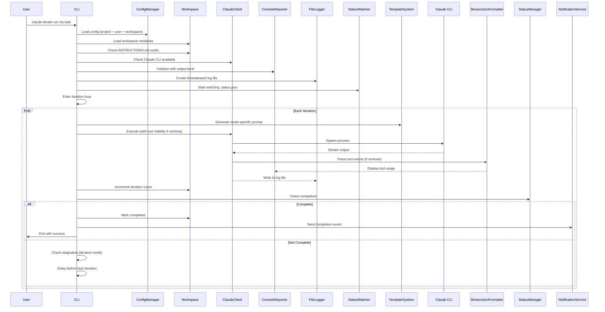
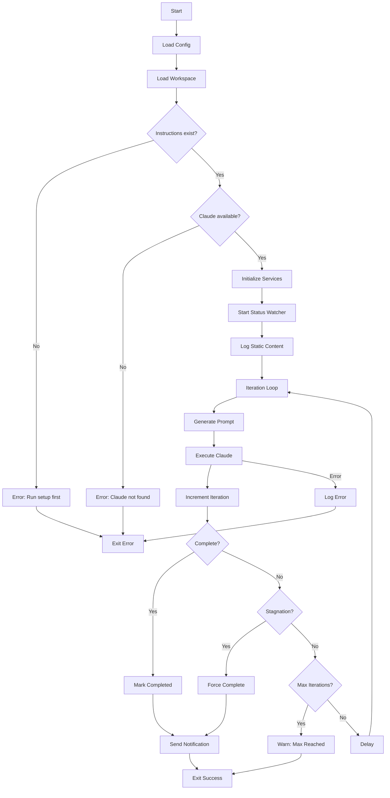
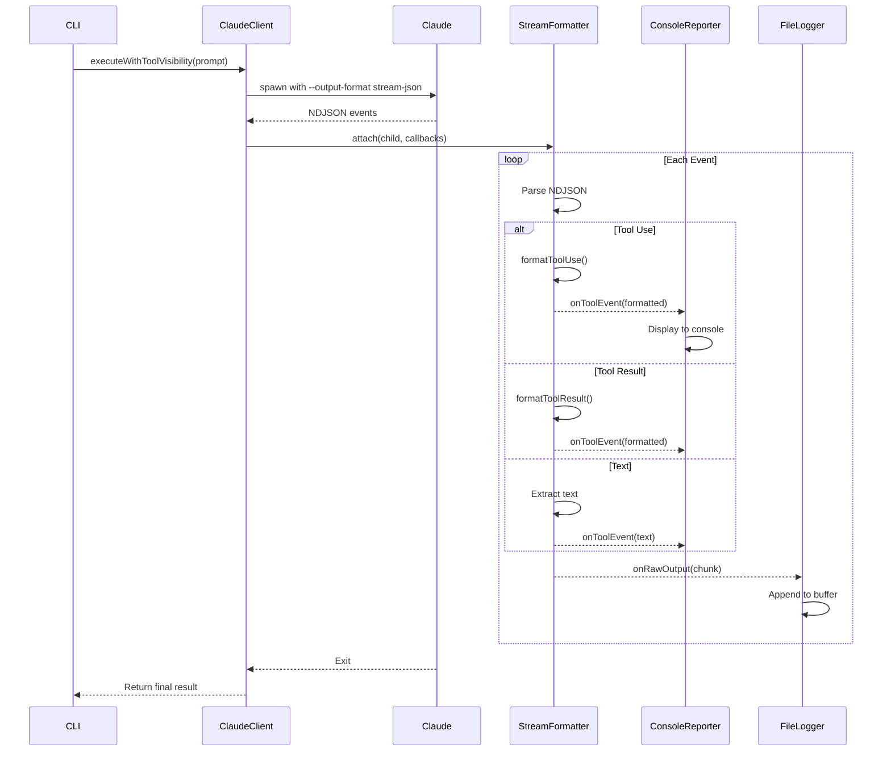

# Technical Specification: Execution

## Specification Layers

This spec is organized into three layers for clarity:

**Layer 1: Functional Requirements (What)**

- Run autonomous iteration loops with Claude CLI
- Support two execution modes (loop and iterative)
- Detect stagnation in iterative mode
- Provide three output levels (quiet, progress, verbose)
- Log execution to timestamped files

**Layer 2: Architecture & Design (How - Language Agnostic)**

- Claude CLI integration via child process spawning
- Mode-specific prompt strategies
- Status file watching for progress notifications
- Stream-based tool visibility parsing
- File-based logging with deduplication

**Layer 3: Implementation Standards (How - Language Specific)**

- TypeScript 5.8+ with Commander.js CLI framework
- Node.js `child_process` for subprocess management
- `ndjson` package for stream parsing (~10KB)
- Vitest for testing with mocked Claude client

## Public Contract / API

### CLI Command

```bash
claude-iterate run <workspace-name> [options]
```

**Options:**

- `-m, --max-iterations <number>` - Override max iterations
- `-d, --delay <seconds>` - Override delay between iterations
- `--no-delay` - Skip delay between iterations
- `--stagnation-threshold <number>` - Stop after N consecutive no-work iterations (iterative mode only, 0=never)
- `-v, --verbose` - Show full Claude output (equivalent to --output verbose)
- `-q, --quiet` - Silent execution, errors only (equivalent to --output quiet)
- `--output <level>` - Output level: quiet, progress, verbose
- `--dangerously-skip-permissions` - Skip permission prompts (runtime only, not saved to config)
- `--dry-run` - Use mock Claude for testing (logs to /tmp/mock-claude.log)

**Exit Codes:**

- 0: Success (task completed or max iterations reached)
- 1: Error (validation failed, Claude not found, execution error)

### Public Events (Notifications)

If notification URL is configured, the following events are emitted:

- `execution_start` - Execution begins
- `iteration` - After each iteration
- `iteration_milestone` - Every 10 iterations
- `status_update` - When `.status.json` file changes
- `completion` - Task completed successfully
- `error` - Execution error encountered

## Dependencies

- [Workspace Management](../workspace-management/SPEC.md) - Used to load workspace metadata and instructions
- [Configuration](../configuration/SPEC.md) - Used to load project/user/workspace config
- [Notifications](../notifications/SPEC.md) - Used to send HTTP notifications

## Command Invocation

### Prerequisites

1. Workspace exists with valid `.metadata.json`
2. `INSTRUCTIONS.md` file exists in workspace (created by `setup` command)
3. Claude CLI is installed and available in PATH

### Invocation Flow



## Execution Modes

### Loop Mode

**Characteristics:**

- Incremental progress, one item per iteration
- Explicit step tracking in TODO.md
- Uses progress counts (X/Y items)
- Default max iterations: 50
- Best for tasks with discrete steps

**Prompt Strategy:**

- System prompt: `/src/templates/prompts/loop/iteration-system.md`
- User prompt: `/src/templates/prompts/loop/iteration.md`
- Emphasizes: "Complete ONE item this iteration"

**Status Tracking:**

```json
{
  "complete": false,
  "progress": {
    "completed": 35,
    "total": 60
  },
  "summary": "Migrated 35/60 API endpoints",
  "lastUpdated": "2025-10-16T14:30:00Z"
}
```

### Iterative Mode

**Characteristics:**

- Autonomous work sessions, multiple items per iteration
- Complete as many items as possible
- Uses work detection (worked: true/false)
- Default max iterations: 20
- Best for complex tasks requiring sustained focus

**Prompt Strategy:**

- System prompt: `/src/templates/prompts/iterative/iteration-system.md`
- User prompt: `/src/templates/prompts/iterative/iteration.md`
- Emphasizes: "Work autonomously, complete as much as possible"

**Status Tracking:**

```json
{
  "complete": false,
  "worked": true,
  "summary": "Implemented authentication middleware and updated 3 routes",
  "lastUpdated": "2025-10-16T14:30:00Z"
}
```

**Stagnation Detection:**

- Enabled only in iterative mode
- Default threshold: 2 consecutive no-work iterations
- Checks `.status.json` field: `worked: false`
- Resets counter when `worked: true`
- Threshold 0 = disabled (trust Claude completely)

## Output Levels

### Quiet

- Silent execution, errors only
- No progress messages
- No tool visibility
- Exit codes for automation

### Progress (Default)

- Iteration progress: "Running iteration 1..."
- Completion status: "✓ Task completed successfully after 5 iterations"
- Remaining counts: "(4 items remaining)"
- No Claude output or tool details

### Verbose

- All progress messages
- Full Claude output (streamed)
- Real-time tool visibility:
  - Tool name and parameters
  - File paths, commands, patterns
  - Success/error indicators
  - Formatted results
- Useful for debugging and monitoring

## Claude CLI Integration

### Spawn Configuration

**Working Directory:**

- Runs from project root (`process.cwd()`)
- Allows Claude to access all project files
- Workspace files accessed via absolute paths in prompts

**Arguments:**

- Base args from config: `claude.args` (e.g., `--dangerously-skip-permissions`)
- Runtime override: `--dangerously-skip-permissions` (not saved to config)
- Non-interactive: `--print` (one-shot mode)
- Tool visibility: `--output-format stream-json --verbose` (verbose mode only)
- System prompt: `--append-system-prompt <text>`
- User prompt: Final positional argument

**Process Management:**

- Single child process at a time
- Tracked via `ClaudeClient.currentChild`
- Graceful shutdown on SIGINT/SIGTERM
- Zombie detection: 5-minute timeout with exit code check

### Execution Methods

**executeNonInteractive()** (Progress/Quiet modes):

- Standard child process with piped stdout/stderr
- Streams output to console and log file
- Returns stdout as string
- No tool visibility overhead

**executeWithToolVisibility()** (Verbose mode):

- Uses `--output-format stream-json --verbose`
- Attaches `StreamJsonFormatter` to parse NDJSON events
- Provides callbacks: `onToolEvent`, `onRawOutput`, `onError`
- Extracts final result from stream

## Tool Visibility

### Stream-JSON Format

Claude CLI emits NDJSON events:

**Tool Use Event:**

```json
{
  "type": "assistant",
  "message": {
    "content": [
      {
        "type": "tool_use",
        "name": "Read",
        "input": { "file_path": "/path/to/file" }
      }
    ]
  }
}
```

**Tool Result Event:**

```json
{
  "type": "user",
  "message": {
    "content": [
      {
        "type": "tool_result",
        "content": "File contents...",
        "is_error": false
      }
    ]
  }
}
```

### Formatted Output

**Tool Use:**

```
🔧 Read tool
   File: /workspace/repo/TODO.md
```

**Tool Result (Success):**

```
✓ File read successfully (45 lines)
     1 | # TODO
     2 | - [x] Task 1
     ... (truncated for large files)
```

**Tool Result (Error):**

```
❌ Edit failed: String not found in file

   The search string was not found in the file. This could be because:
   - The string has already been changed
   - The string contains special characters that don't match exactly
   - The line breaks or spacing differ from what's in the file

   Tip: Use the Read tool to verify the current file content
```

### Supported Tools

- **Read**: Shows file path, line range, content preview (15 lines max)
- **Edit**: Shows old/new strings (never truncated), replace mode
- **Write**: Shows file path, content size (KB/lines)
- **Bash**: Shows command, exit code, output (20 lines max)
- **Grep**: Shows pattern, results
- **Glob**: Shows pattern, matches

## File Logging

### Log File Format

**Filename:** `iterate-YYYYMMDD-HHMMSS.log` (e.g., `iterate-20251015-142345.log`)

**Structure:**

```
================================================================================
CLAUDE ITERATE - EXECUTION LOG
Started: 2025-10-15T14:23:45.000Z
================================================================================

================================================================================
RUN METADATA
================================================================================
Workspace: my-task
Mode: loop
Max Iterations: 50
Start Time: 2025-10-15T14:23:45.000Z

================================================================================
INSTRUCTIONS
================================================================================
[Instructions content logged once]

================================================================================
SYSTEM PROMPT
================================================================================
[System prompt logged once]

================================================================================
ITERATION 1
Started: 2025-10-15T14:23:50.000Z
================================================================================

CLAUDE OUTPUT:
[Iteration 1 output]

STATUS: success
Completed: 2025-10-15T14:24:15.000Z
Remaining: 4

================================================================================
ITERATION 2
Started: 2025-10-15T14:24:17.000Z
================================================================================
...
```

### Deduplication

Static content logged once at run start:

- Run metadata (workspace, mode, max iterations)
- Instructions from `INSTRUCTIONS.md`
- System prompt (mode-specific)
- Status instructions from `.status-instructions.md` (if exists)

Iteration-specific content logged per iteration:

- Iteration number and timestamp
- Claude output (full or tool events)
- Completion status and remaining count
- Errors (with stack traces)

### Buffering

- 10KB buffer for streaming output
- Auto-flush when buffer exceeds 10KB
- Manual flush at iteration completion and shutdown
- Graceful failure: Disables logging if file write fails

## Status File Watching

### Real-Time Notifications

Watches `.status.json` for changes:

- Debounced with 2-second delay (configurable)
- Filters timestamp-only changes (meaningless)
- Sends notification with progress delta

**Notification Format:**

```
STATUS UPDATE

35/60 items (+5) - Migrated 35/60 API endpoints
```

**Delta Calculation:**

- Compares previous and current status
- Tracks `completedDelta` (items completed since last update)
- Includes completion indicator: "✅ Complete!"

### Configuration

```json
{
  "notification": {
    "statusWatch": {
      "enabled": true,
      "debounceMs": 2000,
      "notifyOnlyMeaningful": true
    }
  }
}
```

## Completion Detection

### Primary: .status.json

Machine-readable status file:

```json
{
  "complete": true,
  "progress": {
    "completed": 60,
    "total": 60
  },
  "summary": "All API endpoints migrated successfully",
  "lastUpdated": "2025-10-16T15:30:00Z"
}
```

**Detection Logic:**

```typescript
const status = await StatusManager.read(workspacePath);
return status.complete === true;
```

### Fallback: TODO.md Parsing

Legacy method (used if `.status.json` doesn't exist or is invalid):

- Extracts remaining count from TODO.md
- Checks for completion markers
- Less reliable (prone to false positives)

### Why .status.json?

- Prevents false positives from completion markers in instructions or examples
- Machine-readable (no string parsing ambiguity)
- Supports both loop mode (progress) and iterative mode (worked)
- Claude can easily update via Write tool

## Error Handling & Edge Cases

### Error Cases

1. **Claude CLI not found**
   - Return: Exit code 1
   - Message: "Claude CLI not found. Make sure 'claude' is installed and in PATH."
   - Action: Check `ClaudeClient.isAvailable()` before execution

2. **Instructions not found**
   - Return: Exit code 1
   - Message: "Instructions not found. Run setup first: claude-iterate setup <name>"
   - Action: Exit immediately, no iterations run

3. **Claude execution failed**
   - Return: Exit code 1
   - Message: "Iteration N failed" with error details
   - Action: Mark workspace error, send error notification, exit

4. **Reached max iterations**
   - Return: Exit code 0
   - Message: "⚠️ Reached maximum iterations (N)"
   - Action: Display options (continue, increase limit, check progress)

5. **Stagnation detected (iterative mode)**
   - Return: Exit code 0
   - Message: "⚠️ Stagnation detected: N consecutive iterations with no work"
   - Action: Mark task complete, send completion notification

### Edge Cases

1. **Multiple simultaneous run commands**
   - Behavior: Each run creates separate Claude process
   - Workspace locking: Not implemented (user responsibility)
   - Recommendation: Don't run simultaneously on same workspace

2. **User interruption (Ctrl+C)**
   - Behavior: Graceful shutdown via SIGINT handler
   - Claude process killed: SIGTERM → wait 5s → SIGKILL
   - Log buffers flushed before exit

3. **Zombie process detection**
   - Behavior: 5-minute timeout checks `child.exitCode !== null`
   - If zombie: Resolve with stdout (likely success)
   - If still running: Reject with timeout error

4. **Status file changes during iteration**
   - Behavior: File watcher triggers notification
   - Iteration continues (no interruption)
   - Next iteration checks completion

5. **No work detected on first iteration (iterative mode)**
   - Behavior: Increment `noWorkCount` to 1
   - Continue (threshold typically 2)
   - Prevents premature completion

## Security & Non-Functional Requirements

### Security

**Permission Prompts:**

- Default: Claude CLI prompts for file/command permissions
- Override: `--dangerously-skip-permissions` flag
- Runtime vs. Config: Runtime flag not saved to config
- Warning: Displayed when flag is used

**Sensitive Data:**

- Log files may contain workspace content
- Store in workspace directory (user-controlled)
- Not gitignored (pre-commit hook prevents accidental commits)

**Command Injection:**

- Claude command/args validated by Node.js `spawn` (no shell)
- User prompts passed as positional arguments (no interpolation)

### Performance

**Iteration Latency:**

- Delay between iterations: Default 2 seconds (configurable)
- Claude execution time: Variable (depends on task complexity)
- Log file I/O: Async, non-blocking

**Memory Usage:**

- Single Claude process at a time
- Log buffer: 10KB max before flush
- Status watcher: Minimal overhead (file watcher + debounce)

**Zombie Process Prevention:**

- 5-minute timeout for detection
- Prevents indefinite hangs
- Logs diagnostic information (stdout/stderr length)

### Monitoring

**Metrics (Logged):**

- Total iterations executed
- Execution iterations (separate counter)
- Iteration timestamps (start/end)
- Remaining count per iteration
- Completion status

**Notifications (Optional):**

- Execution start
- Each iteration
- Milestones (every 10 iterations)
- Status updates (real-time)
- Completion
- Errors

## Visual Aids

### Execution Flow



### Tool Visibility Flow



## Implementation Notes

**Test Coverage:**

- 228 passing tests (all mocked, no real Claude calls)
- Mock Claude client: `tests/mocks/claude-client.mock.ts`
- Fast, deterministic, CI-friendly

**Dependencies:**

- `ndjson` package for stream-json parsing (~10KB)
- Graceful error handling with `strict: false`

**Prompt Management:**

- Templates in `src/templates/prompts/` directory
- Token replacement: `{{projectRoot}}`, `{{workspacePath}}`
- Mode-specific strategies: `src/templates/modes/`

**Codebase Patterns:**

- 2-space indentation
- Single quotes for strings
- Semicolons required
- TypeScript strict mode
- ESLint + Prettier formatting
