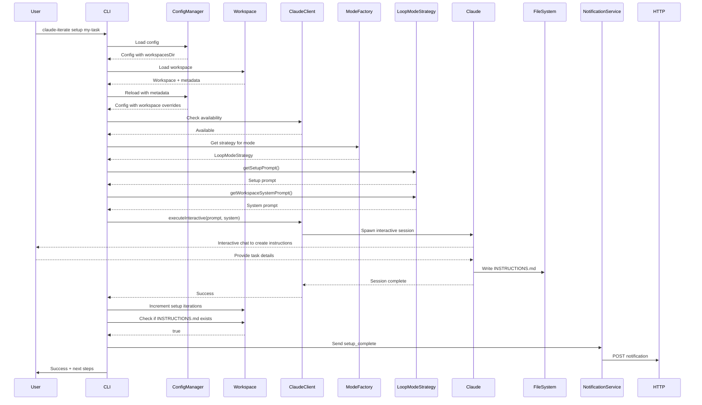
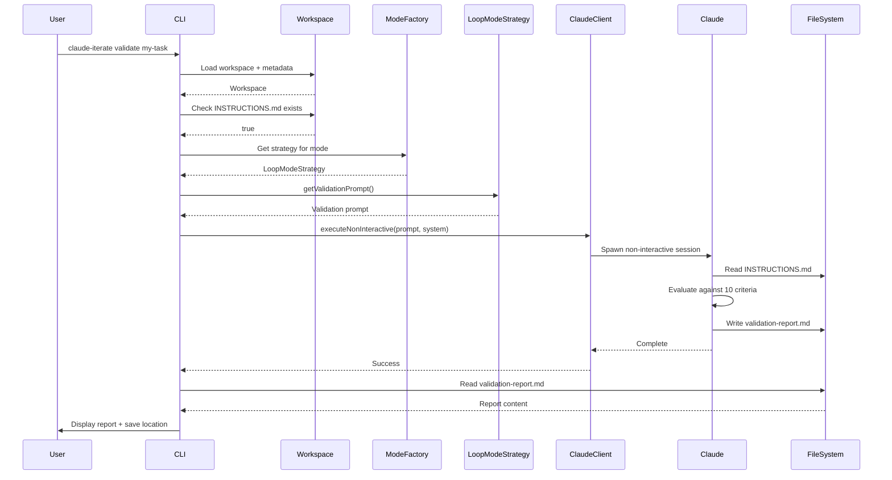

# Technical Specification: Instructions Management

## Specification Layers

This spec documents the instructions management feature which enables interactive creation, editing, and validation of workspace instructions.

## Public Contract / API

### CLI Commands

- `claude-iterate setup <name>` - Set up workspace instructions interactively
- `claude-iterate edit <name>` - Edit workspace instructions interactively
- `claude-iterate validate <name>` - Validate workspace instructions

These commands are part of the public CLI interface consumed by end users.

## Dependencies

- [Workspace Management](../workspace-management/SPEC.md) - Used to load workspaces, check instruction files, increment iteration counts
- [Configuration](../configuration/SPEC.md) - Used to load config with workspace-level overrides
- [Execution](../execution/SPEC.md) - Uses ClaudeClient to execute interactive and non-interactive Claude sessions
- [Notifications](../notifications/SPEC.md) - Used to send setup completion notifications

## CLI Commands (Detailed)

### `claude-iterate setup <name>`

**Description:** Launches interactive Claude session to create INSTRUCTIONS.md for a workspace

**Arguments:**

- `<name>` (required) - Workspace name (string, existing workspace)

**Options:**

- `--colors / --no-colors` (inherited) - Enable/disable colored output (default: true)

**Interactive Flow:**

1. Load workspace and metadata
2. Display header: "Setting up instructions: {name}"
3. Check if Claude CLI is available (exit 1 if not)
4. Generate mode-aware setup prompt and system prompt
5. Execute Claude interactively from project root
6. Increment setup iteration count in metadata
7. Check if INSTRUCTIONS.md was created
8. Send notification if configured and instructions created
9. Display next steps: validate, edit, run

**Success Output:**

```
Instructions created successfully!

Next steps:
  • Validate: claude-iterate validate {name}
  • Edit: claude-iterate edit {name}
  • Run: claude-iterate run {name}
```

**Error Cases:**

- Workspace not found: "Workspace not found: {name}" (exit 1)
- Claude CLI not available: "Claude CLI not found. Make sure 'claude' is installed and in PATH." (exit 1)
- Instructions not created: "Instructions file not found. You may need to run setup again." (exit 0, warning)
- Setup failed: "Setup failed: {error}" (exit 1)

**Exit Codes:**

- 0: Success or soft warning
- 1: Error (workspace not found, Claude unavailable, setup failed)

### `claude-iterate edit <name>`

**Description:** Launches interactive Claude session to modify existing INSTRUCTIONS.md

**Arguments:**

- `<name>` (required) - Workspace name (string, existing workspace with instructions)

**Options:**

- `--colors / --no-colors` (inherited) - Enable/disable colored output (default: true)

**Interactive Flow:**

1. Load workspace and metadata
2. Check if INSTRUCTIONS.md exists (exit 1 if not)
3. Display header: "Editing instructions: {name}"
4. Check if Claude CLI is available (exit 1 if not)
5. Generate mode-aware edit prompt and system prompt
6. Execute Claude interactively from project root
7. Increment setup iteration count in metadata
8. Display next steps: validate, run

**Success Output:**

```
Instructions updated successfully!

Next steps:
  • Validate: claude-iterate validate {name}
  • Run: claude-iterate run {name}
```

**Error Cases:**

- Workspace not found: "Workspace not found: {name}" (exit 1)
- Instructions not found: "Instructions not found. Run setup first: claude-iterate setup {name}" (exit 1)
- Claude CLI not available: "Claude CLI not found. Make sure 'claude' is installed and in PATH." (exit 1)
- Edit failed: "Edit failed: {error}" (exit 1)

**Exit Codes:**

- 0: Success
- 1: Error (workspace/instructions not found, Claude unavailable, edit failed)

### `claude-iterate validate <name>`

**Description:** Analyzes INSTRUCTIONS.md against validation criteria and generates report

**Arguments:**

- `<name>` (required) - Workspace name (string, existing workspace with instructions)

**Options:**

- `--colors / --no-colors` (inherited) - Enable/disable colored output (default: true)

**Non-Interactive Flow:**

1. Load workspace and metadata
2. Check if INSTRUCTIONS.md exists (exit 1 if not)
3. Display header: "Validating instructions: {name}"
4. Check if Claude CLI is available (exit 1 if not)
5. Generate mode-aware validation prompt and system prompt
6. Execute Claude non-interactively from project root
7. Check if validation report was created
8. Display report content in console
9. Display success message with report path

**Success Output:**

```
Analyzing instructions against validation criteria...

{full report content}

Validation report saved: {workspace-path}/validation-report.md
```

**Report Location:** `{workspace-path}/validation-report.md`

**Error Cases:**

- Workspace not found: "Workspace not found: {name}" (exit 1)
- Instructions not found: "Instructions not found. Run setup first: claude-iterate setup {name}" (exit 1)
- Claude CLI not available: "Claude CLI not found. Make sure 'claude' is installed and in PATH." (exit 1)
- Report not created: "Validation report not created" (exit 0, warning)
- Validation failed: "Validation failed: {error}" (exit 1)

**Exit Codes:**

- 0: Success or soft warning
- 1: Error (workspace/instructions not found, Claude unavailable, validation failed)

## Prompt System Architecture

### Mode-Aware Prompts

All commands use mode-aware prompts via ModeFactory pattern:

**Template Structure:**

```
src/templates/prompts/
├── workspace-system.md          # Mode-agnostic system context
├── loop/                         # Loop mode templates
│   ├── setup.md                 # Setup prompt
│   ├── edit.md                  # Edit prompt
│   ├── validate.md              # Validation prompt
│   └── validation-criteria.md  # Quality criteria
└── iterative/                    # Iterative mode templates
    ├── setup.md
    ├── edit.md
    ├── validate.md
    └── validation-criteria.md
```

**Template Tokens:**

- `{{workspaceName}}` - Workspace name
- `{{workspacePath}}` - Absolute path to workspace directory
- `{{validationCriteria}}` - Mode-specific validation criteria
- `{{reportPath}}` - Absolute path to validation report

**Prompt Loading:**

1. Get mode from workspace metadata (loop or iterative)
2. Select mode strategy via ModeFactory
3. Strategy loads appropriate template with token replacement
4. Return rendered prompt string

### Validation Criteria

**7 REQUIRED Criteria:**

1. Autonomous Execution - Can Claude follow without human help?
2. State Awareness - Checks if TODO.md exists, decides initialize or resume?
3. Re-runnable - Counts calculated from source (not hardcoded)?
4. Clear TODO.md Format - Explicit template showing what to track?
5. Error Handling - What happens when operations fail?
6. Appropriate Scale - Batching strategy for 10+ items?
7. Completion Detection - Uses "Remaining: 0" or unambiguous criteria?

**3 RECOMMENDED Criteria:** 8. Dynamic Counting - Count from source at bootstrap 9. Task Instructions Focus - Focus on WHAT (task goals), not HOW (system mechanics) 10. Quality Standards - Define what "done" means

**Critical Principle:**
Instructions must NEVER reference:

- "iterations", "each iteration", "between iterations"
- "loop stops when", "system calls you"
- "re-invoked", "no memory between iterations"
- Any system mechanics or claude-iterate implementation details

Focus only on:

- WHAT to accomplish (task goals)
- Work breakdown approach
- Completion criteria (user-defined)
- Quality standards
- Error handling

## Data Flow

### Setup Command Flow



### Validate Command Flow



## Error Handling & Edge Cases

### Error Cases

1. **Workspace Not Found**
   - Return: Exit code 1
   - Message: "Workspace not found: {name}"
   - Action: Log error, exit

2. **Instructions Not Found (edit/validate)**
   - Return: Exit code 1
   - Message: "Instructions not found. Run setup first: claude-iterate setup {name}"
   - Action: Log error, exit

3. **Claude CLI Not Available**
   - Return: Exit code 1
   - Message: "Claude CLI not found. Make sure 'claude' is installed and in PATH."
   - Action: Log error, exit

4. **Instructions Not Created After Setup**
   - Return: Exit code 0 (warning)
   - Message: "Instructions file not found. You may need to run setup again."
   - Action: Log warning, continue

5. **Validation Report Not Created**
   - Return: Exit code 0 (warning)
   - Message: "Validation report not created"
   - Action: Log warning, continue

6. **Command Execution Failed**
   - Return: Exit code 1
   - Message: "{Command} failed: {error}"
   - Action: Log full error stack, exit

### Edge Cases

1. **User Cancels Interactive Session**
   - Behavior: Claude session exits, no INSTRUCTIONS.md created
   - CLI shows warning message
   - Can re-run setup to try again

2. **Workspace Config Overrides**
   - Behavior: Load config twice (once for path, once with metadata for workspace overrides)
   - Ensures workspace-level settings (claudeCommand, claudeArgs) are respected

3. **Mode-Specific Templates**
   - Behavior: Strategy pattern selects template based on metadata.mode
   - Loop and iterative modes have different validation criteria

4. **Notification Not Configured**
   - Behavior: Skip notification silently
   - No error thrown

5. **Multiple Setup Runs**
   - Behavior: Each run increments setupIterations count
   - Allows iterative refinement of instructions
   - No limit on setup iterations

## Security & Non-Functional Requirements

### Security

- Commands spawn Claude CLI as child process with inherited stdio
- No API keys required (uses Claude CLI installation)
- Workspace paths validated before use
- No network access except Claude CLI and optional notifications

### Performance

- Interactive commands block until user completes session
- Validate command completes in <30 seconds (depends on Claude API)
- Template loading cached in memory after first use
- Config loading optimized with workspace-aware caching

### Monitoring

- All commands log to console with Logger utility
- Setup iterations tracked in workspace metadata
- Notification events logged if verbose mode enabled

## Implementation Notes

**Investigation Findings:**

**Similar Features:**

- Commands follow pattern: init, run, verify (workspace lifecycle)
- All use Workspace.load() for consistent workspace access
- All use ConfigManager.load() with metadata for workspace overrides

**Dependencies:**

- Workspace: src/core/workspace.ts provides getMetadata(), hasInstructions(), incrementIterations()
- ClaudeClient: src/services/claude-client.ts provides executeInteractive(), executeNonInteractive(), isAvailable()
- NotificationService: src/services/notification-service.ts provides send(), isConfigured(), shouldNotify()
- ModeFactory: src/templates/modes/mode-factory.ts provides getStrategy()

**Testing Patterns:**

- Framework: Vitest
- Test location: tests/unit/commands/{command}.test.ts (no current tests for setup/edit/validate)
- Mocking: All tests use mocked ClaudeClient (tests/mocks/claude-client.mock.ts)
- Coverage target: >=80%

**Code Patterns:**

- Indentation: 2 spaces
- Quotes: Single quotes
- Async/await for all file operations
- Error handling: try/catch with Logger.error()
- Exit codes: process.exit(1) for errors, process.exit(0) or implicit 0 for success
