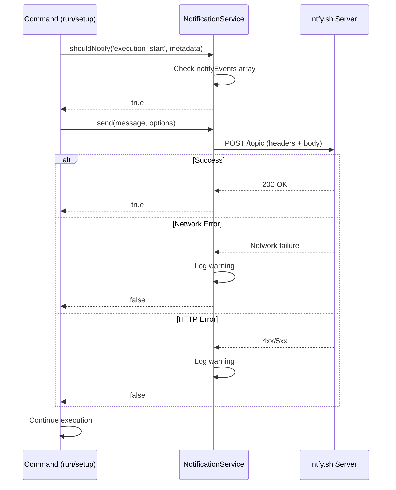
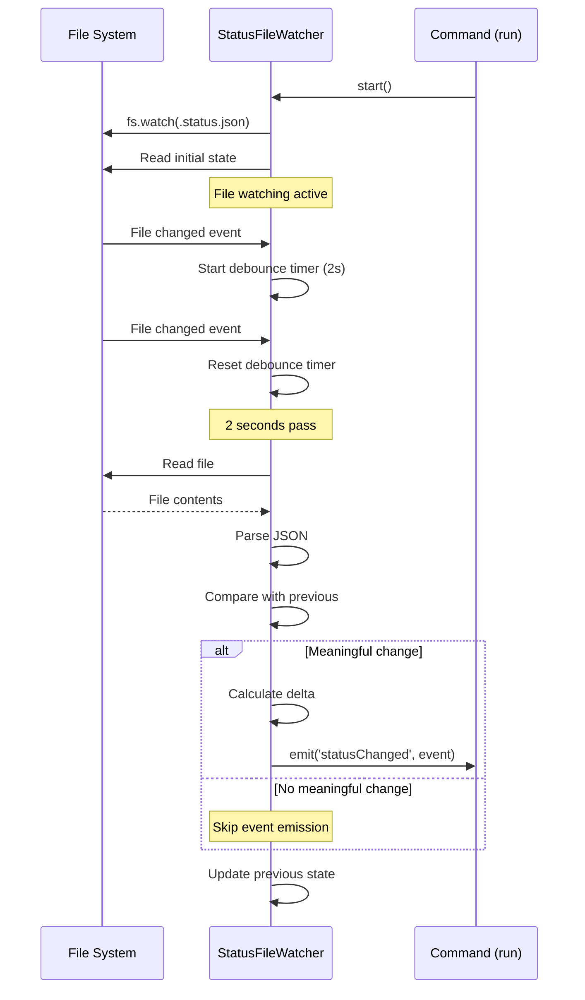
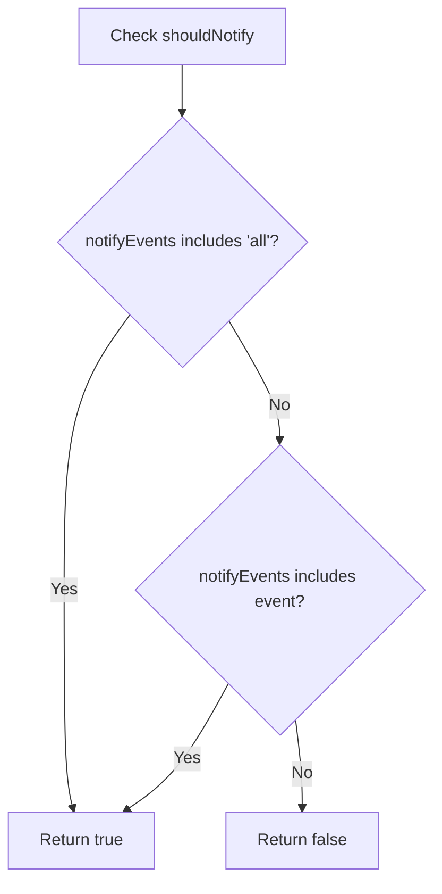

# Technical Specification: Notifications

## Specification Layers

This spec is organized into three layers for clarity:

**Layer 1: Functional Requirements (What)**

- HTTP POST notifications for task execution events
- Configurable event types and notification URLs
- Real-time status updates via file watching

**Layer 2: Architecture & Design (How - Language Agnostic)**

- NotificationService for HTTP POST operations
- StatusFileWatcher for real-time file monitoring
- Event-driven architecture with debouncing
- ntfy.sh-compatible HTTP protocol

**Layer 3: Implementation Standards (How - Language Specific)**

- TypeScript with Zod validation
- Node.js native `fetch` API
- Node.js native `fs.watch` for file monitoring
- EventEmitter pattern for status events

## Public Contract / API

### NotificationService Class

```typescript
export class NotificationService {
  constructor(logger?: Logger, verbose?: boolean);

  // Send notification via HTTP POST
  send(message: string, options: NotificationOptions): Promise<boolean>;

  // Check if notifications are configured
  isConfigured(metadata: Metadata): boolean;

  // Check if should notify for event
  shouldNotify(event: string, metadata: Metadata): boolean;
}
```

### NotificationOptions Interface

```typescript
export interface NotificationOptions {
  url: string;
  title?: string;
  priority?: 'low' | 'default' | 'high' | 'urgent';
  tags?: string[];
}
```

### StatusFileWatcher Class

```typescript
export class StatusFileWatcher extends EventEmitter {
  constructor(statusPath: string, options?: StatusFileWatcherOptions);

  // Start watching file
  start(): void;

  // Stop watching and cleanup
  stop(): void;

  // Event: 'statusChanged' → StatusChangedEvent
}
```

### Event Types

```typescript
export type NotificationEvent =
  | 'setup_complete' // Setup command completed
  | 'execution_start' // Run command started
  | 'iteration' // Each iteration completed
  | 'iteration_milestone' // Every 10th iteration
  | 'completion' // Task completed successfully
  | 'error' // Error encountered
  | 'status_update' // .status.json file changed
  | 'all'; // All events (default)
```

## Dependencies

None - Internal feature only. Uses Node.js built-in APIs (`fetch`, `fs.watch`, `events`).

## Notification Service API (Detailed)

### HTTP POST Request Format

**URL:** User-configured (e.g., `https://ntfy.sh/my-topic`)

**Method:** `POST`

**Headers:**

```
Content-Type: text/plain
Title: [optional - notification title]
Priority: [optional - low|default|high|urgent]
Tags: [optional - comma-separated tags]
```

**Body:** Plain text message (notification content)

**Success Response:** HTTP 200-299 status codes

**Error Handling:**

- Network errors → Log warning, return `false`, continue execution
- HTTP 4xx/5xx → Log warning, return `false`, continue execution
- Never throw exceptions (notifications are non-critical)

### NotificationService Methods

#### `send(message: string, options: NotificationOptions): Promise<boolean>`

Sends HTTP POST notification to configured URL.

**Parameters:**

- `message`: Plain text notification body
- `options.url`: Target URL (required)
- `options.title`: Notification title (optional)
- `options.priority`: Priority level (optional, default: none)
- `options.tags`: Array of tags (optional, joined with comma)

**Returns:** `true` if sent successfully, `false` on failure

**Error Behavior:** Logs warning, returns `false`, never throws

#### `isConfigured(metadata: Metadata): boolean`

Checks if notification URL is configured and non-empty.

**Parameters:**

- `metadata`: Workspace metadata object

**Returns:** `true` if `notifyUrl` exists and is non-whitespace string

#### `shouldNotify(event: string, metadata: Metadata): boolean`

Determines if notification should be sent for given event.

**Parameters:**

- `event`: Event name to check
- `metadata`: Workspace metadata with `notifyEvents` array

**Logic:**

1. If `notifyEvents` includes `'all'` → return `true`
2. If `notifyEvents` includes `event` → return `true`
3. Otherwise → return `false`

**Returns:** `true` if event is enabled, `false` otherwise

## Status File Watcher API (Detailed)

### StatusFileWatcher Constructor

```typescript
constructor(statusPath: string, options?: StatusFileWatcherOptions)
```

**Parameters:**

- `statusPath`: Absolute path to `.status.json` file
- `options.debounceMs`: Debounce delay in milliseconds (default: 2000)
- `options.notifyOnlyMeaningful`: Filter timestamp-only changes (default: true)

### StatusFileWatcher Methods

#### `start(): void`

Starts watching the status file for changes.

**Behavior:**

- Reads initial state from file
- Starts `fs.watch` listener for file changes
- Idempotent (safe to call multiple times)
- Does not throw on ENOENT (file may not exist yet)

#### `stop(): void`

Stops watching and cleans up resources.

**Behavior:**

- Clears debounce timer
- Closes `fs.watch` watcher
- Removes all event listeners
- Idempotent (safe to call multiple times)

### StatusChangedEvent Structure

```typescript
export interface StatusChangedEvent {
  previous: WorkspaceStatus | null; // Previous state (null on first change)
  current: WorkspaceStatus; // Current state
  delta: StatusDelta; // Calculated changes
  timestamp: Date; // Event timestamp
}

export interface StatusDelta {
  progressChanged: boolean; // Progress counts changed
  completedDelta: number; // Change in completed count
  totalDelta: number; // Change in total count
  completionStatusChanged: boolean; // Complete flag changed
  summaryChanged: boolean; // Summary text changed
}
```

### Event Emission Logic

1. File change detected via `fs.watch`
2. Debounce timer starts (cancels previous timer if exists)
3. After debounce period expires:
   - Read and parse `.status.json`
   - Compare with previous state
   - If meaningful change detected → emit `statusChanged` event
   - Update previous state reference
4. If file read fails or JSON invalid → log warning, skip event emission

### Meaningful Change Detection

When `notifyOnlyMeaningful: true` (default), only emit events when:

- `progress.completed` value changes
- `progress.total` value changes
- `complete` boolean flag changes
- `summary` text changes

Ignore changes when only `lastUpdated` timestamp differs.

When `notifyOnlyMeaningful: false`, emit event on any file change.

## Data Schemas

### Workspace Metadata Extensions

```typescript
{
  notifyUrl?: string;           // Notification URL (e.g., https://ntfy.sh/topic)
  notifyEvents: NotificationEvent[]; // Default: ['all']
}
```

### Configuration Extensions

```typescript
{
  notifyUrl?: string;           // Default notification URL
  notifyEvents?: NotificationEvent[]; // Default events to notify
  notification?: {
    statusWatch?: {
      enabled?: boolean;        // Default: true
      debounceMs?: number;      // Default: 2000
      notifyOnlyMeaningful?: boolean; // Default: true
    }
  }
}
```

## Validation Rules

### notifyUrl

- **Required:** No
- **Type:** string (URL)
- **Format:** Valid HTTP/HTTPS URL
- **Example:** `https://ntfy.sh/my-topic`
- **Validation:** None enforced (user responsible for valid URL)

### notifyEvents

- **Required:** No
- **Type:** Array of NotificationEvent strings
- **Valid values:** `setup_complete`, `execution_start`, `iteration`, `iteration_milestone`, `completion`, `error`, `status_update`, `all`
- **Default:** `['all']`
- **Example:** `['execution_start', 'completion', 'error']`

### priority

- **Required:** No
- **Type:** Enum string
- **Valid values:** `low`, `default`, `high`, `urgent`
- **Default:** None (header omitted)

### debounceMs

- **Required:** No
- **Type:** number (positive integer)
- **Min:** 100ms (recommended)
- **Max:** 60000ms (1 minute, recommended)
- **Default:** 2000ms
- **Example:** `2000`

## Error Handling & Edge Cases

### Error Cases

1. **Network failure during send**
   - Behavior: Log warning with error message
   - Return: `false`
   - Action: Continue execution, do not retry
   - Message format: `"Notification error: [error.message]"`

2. **HTTP 4xx/5xx response**
   - Behavior: Log warning with status code and text
   - Return: `false`
   - Action: Continue execution, do not retry
   - Message format: `"Notification failed: [status] [statusText]"`

3. **Invalid URL**
   - Behavior: `fetch` throws, caught and logged
   - Return: `false`
   - Action: Continue execution

4. **File watch error (ENOENT)**
   - Behavior: Log warning, skip event emission
   - Action: Watcher continues running (file may be created later)
   - Message format: `"Status file watcher error: [error.message]"`

5. **Malformed JSON in .status.json**
   - Behavior: Parse error caught, skip event emission
   - Action: Watcher continues, waits for valid JSON
   - No error logged (silent failure for performance)

6. **File read permission denied**
   - Behavior: Read error caught, skip event emission
   - Action: Watcher continues running
   - Message format: `"Status file watcher error: [error.message]"`

### Edge Cases

1. **Rapid file changes (multiple writes in <2 seconds)**
   - Behavior: Debounce timer resets on each change
   - Result: Only last state emitted after 2-second quiet period

2. **Notification URL not configured**
   - Behavior: `isConfigured()` returns `false`
   - Result: No HTTP requests sent, execution continues normally

3. **Event not in notifyEvents array**
   - Behavior: `shouldNotify()` returns `false`
   - Result: No notification sent, execution continues

4. **File watcher started before file exists**
   - Behavior: Watcher starts successfully, reads null state
   - Result: First file write triggers event with `previous: null`

5. **Multiple start() calls**
   - Behavior: Check `isRunning` flag, return early if already running
   - Result: No duplicate watchers created

6. **stop() called before start()**
   - Behavior: No-op (graceful handling)
   - Result: No errors

7. **Timestamp-only change with notifyOnlyMeaningful=true**
   - Behavior: `hasSignificantChange()` returns `false`
   - Result: No event emitted

## Security & Non-Functional Requirements

### Security

- No authentication credentials stored (user responsible for URL security)
- URL should use HTTPS for encrypted transmission
- No sensitive data in notification messages (user-provided text only)
- Notification failures do not expose internal paths or data

### Performance

- Notification send must not block execution (async operation)
- File watcher must use minimal CPU (native `fs.watch`, not polling)
- Debouncing prevents excessive event processing
- Failed notifications timeout via `fetch` default timeout (no custom timeout)

### Monitoring

- All notification attempts logged at debug level (if verbose mode enabled)
- Failures logged at warn level (always visible)
- No metrics collected (logging only)

## Visual Aids

### Notification Flow



### Status File Watcher Flow



### Event Configuration Logic



## Implementation Notes

**Integration Points:**

- `src/commands/init.ts`: Accepts `--notify-url` and `--notify-events` flags
- `src/commands/setup.ts`: Sends `setup_complete` notification
- `src/commands/run.ts`: Sends `execution_start`, `iteration`, `iteration_milestone`, `completion`, `error`, `status_update` notifications
- `src/core/workspace.ts`: Stores `notifyUrl` and `notifyEvents` in metadata
- `src/core/config-manager.ts`: Provides default `notifyUrl` and `notifyEvents` from config

**Testing Patterns:**

- Framework: Vitest
- Location: `tests/unit/notification-service.test.ts`, `tests/unit/status-file-watcher.test.ts`, `tests/integration/notification.test.ts`
- Coverage: ≥80% line coverage (currently achieved)
- Mocking: `global.fetch` mocked for HTTP requests, `fs.watch` uses real file system in integration tests

**Code Style:**

- 2-space indentation
- Single quotes for strings
- Semicolons required
- TypeScript strict mode
- ESLint rules enforced

**Dependencies:**

- No external dependencies (uses Node.js built-ins: `fetch`, `fs`, `events`)
- Types from `src/types/notification.ts`, `src/types/metadata.ts`, `src/types/status.ts`

**File Locations:**

- Service: `src/services/notification-service.ts`
- Watcher: `src/services/status-file-watcher.ts`
- Types: `src/types/notification.ts`
- Tests: `tests/unit/`, `tests/integration/`
