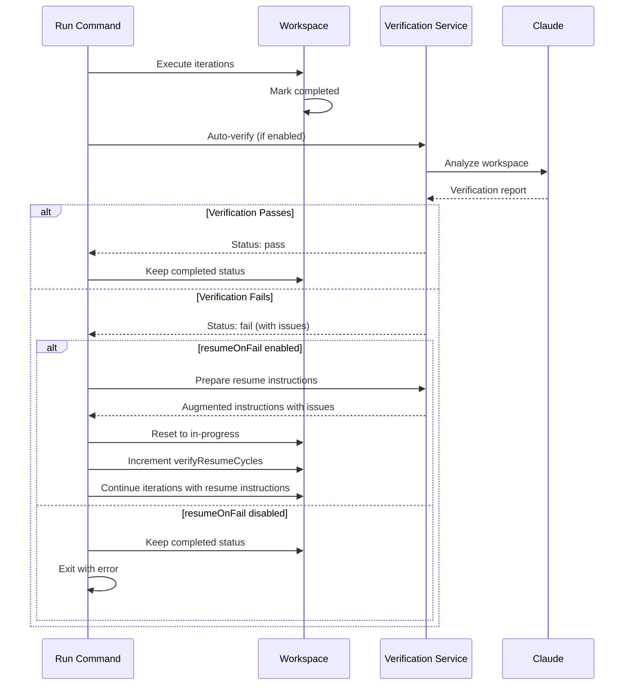

# Technical Specification: Verification

## Specification Layers

This spec is organized into three layers for clarity:

**Layer 1: Functional Requirements (What)**

- What the feature does from a business/user perspective
- User stories, acceptance criteria, business logic

**Layer 2: Architecture & Design (How - Language Agnostic)**

- How the system is structured at a high level
- APIs, data schemas, integration patterns, error handling

**Layer 3: Implementation Standards (How - Language Specific)**

- Specific technologies, versions, frameworks
- Documentation standards, security implementation

## Public Contract / API

This feature provides both CLI commands and programmatic APIs:

### CLI Command

```bash
claude-iterate verify <workspace-name> [options]
```

**Options:**

- `--depth <level>` - Verification depth: quick, standard, deep (default: standard)
- `--report-path <path>` - Custom report path (default: workspace/verification-report.md)
- `--json` - Output JSON results to stdout
- `--show-report` - Show full report in console
- `-v, --verbose` - Show full Claude output
- `-q, --quiet` - Silent execution, errors only
- `--dangerously-skip-permissions` - Skip permission prompts (runtime only)

**Exit Codes:**

- `0` - Verification passed (status: pass)
- `1` - Verification failed or needs review (status: fail or needs_review)

### Public Functions

```typescript
// src/core/verification-service.ts
export class VerificationService {
  async verify(
    workspace: Workspace,
    options?: VerificationOptions
  ): Promise<VerificationResult>;

  async prepareResumeInstructions(
    workspace: Workspace,
    verificationResult: VerificationResult
  ): Promise<string>;
}

export interface VerificationOptions {
  depth?: 'quick' | 'standard' | 'deep';
  reportPath?: string;
}

export interface VerificationResult {
  status: 'pass' | 'fail' | 'needs_review';
  summary: string;
  fullReport: string;
  reportPath: string;
  issueCount: number;
  issues: string[];
  confidence: 'high' | 'medium' | 'low';
  recommendedAction: string;
}
```

### Configuration Schema

```typescript
// Verification config (part of RuntimeConfig)
verification: {
  autoVerify: boolean; // Default: true
  resumeOnFail: boolean; // Default: true
  maxAttempts: number; // Default: 2, range: 1-10
  reportFilename: string; // Default: "verification-report.md"
  depth: 'quick' | 'standard' | 'deep'; // Default: "standard"
  notifyOnVerification: boolean; // Default: true
}
```

## Dependencies

- [Workspace Management](../workspace-management/SPEC.md) - Used to load workspace and access metadata
- [Configuration](../configuration/SPEC.md) - Used to get verification settings and Claude CLI args
- [Execution](../execution/SPEC.md) - Integrates with run command for auto-verification

## CLI Command (Detailed)

### `claude-iterate verify <workspace-name> [options]`

**Description:** Verify workspace work completion by having Claude analyze deliverables

**Authentication:** Not applicable (CLI tool)

**Arguments:**

- `<workspace-name>` - Required, string, 1-100 characters, alphanumeric with hyphens/underscores

**Options:**

| Option                           | Type    | Default                            | Description                                 |
| -------------------------------- | ------- | ---------------------------------- | ------------------------------------------- |
| `--depth`                        | enum    | standard                           | Verification depth: quick, standard, deep   |
| `--report-path`                  | string  | (workspace)/verification-report.md | Custom absolute or relative path for report |
| `--json`                         | boolean | false                              | Output JSON results to stdout               |
| `--show-report`                  | boolean | false                              | Show full report in console                 |
| `-v, --verbose`                  | boolean | false                              | Show full Claude output                     |
| `-q, --quiet`                    | boolean | false                              | Silent execution, errors only               |
| `--dangerously-skip-permissions` | boolean | false                              | Skip Claude permission prompts              |

**Validation Rules:**

- Cannot use both `--verbose` and `--quiet` simultaneously (exit code 1)
- Workspace must exist (exit code 1 with error message)
- Instructions must exist in workspace (exit code 1 with guidance to run setup)
- Depth must be one of: quick, standard, deep (validated by Commander)
- Report path must be writable (Claude will fail if not writable)

**Success Output (JSON mode):**

```json
{
  "status": "pass",
  "summary": "All 60 API endpoints migrated with tests",
  "fullReport": "# Verification Report\n\n...",
  "reportPath": "/absolute/path/to/report.md",
  "issueCount": 0,
  "issues": [],
  "confidence": "high",
  "recommendedAction": "Mark complete and archive"
}
```

**Success Output (Standard mode):**

```
Verifying workspace: api-migration

All 60 API endpoints migrated with tests

✅ VERIFICATION PASSED

Full report: /path/to/verification-report.md
```

**Error Responses:**

- Exit code 1 with error message to stderr
- Common errors documented in Error Handling section below

## Data Schemas

### Workspace Metadata Extension

Verification adds the following fields to workspace `.metadata.json`:

```typescript
interface WorkspaceMetadata {
  // ... existing fields ...
  verification?: {
    lastVerificationStatus: 'pass' | 'fail' | 'needs_review';
    lastVerificationTime: string; // ISO 8601 timestamp
    verificationAttempts: number; // Total attempts for this workspace
    verifyResumeCycles: number; // Number of resume cycles (for auto-resume)
  };
}
```

**Field Details:**

| Field                  | Type   | Constraints              | Description                           |
| ---------------------- | ------ | ------------------------ | ------------------------------------- |
| lastVerificationStatus | enum   | pass, fail, needs_review | Result of most recent verification    |
| lastVerificationTime   | string | ISO 8601 format          | Timestamp of last verification        |
| verificationAttempts   | number | >= 0                     | Incremented on each verify command    |
| verifyResumeCycles     | number | >= 0                     | Incremented on each auto-resume cycle |

**Indexes:** None (small JSON file, not a database)

**Relationships:** Part of workspace metadata, one-to-one with workspace

### Verification Report Schema

Reports are markdown files with this structure:

```markdown
# Verification Report

## Summary

[One-paragraph summary of verification findings]

[Status marker: ✅ VERIFIED COMPLETE or ✅ VERIFIED or ❌ INCOMPLETE]

## Deliverables Verified

[List of verified complete items]

### Incomplete Requirements

1. **Item Name**: Description of issue
2. **Another Item**: Description of issue

**Confidence Level**: [High|Medium|Low]
**Recommended Action**: [Specific action to take]
```

**Parsing Rules:**

- Status determined by presence of markers: `✅ VERIFIED COMPLETE`, `✅ VERIFIED`, or `❌ INCOMPLETE`
- Summary extracted from content between `## Summary` and next `##` heading
- Issues extracted from numbered list under `### Incomplete Requirements` section
- Confidence level extracted from `**Confidence Level**: [value]` pattern
- Recommended action extracted from `**Recommended Action**: [value]` pattern
- If no markers found, status defaults to `needs_review`

## Verification Depth Levels

### Quick Depth (~500-1K tokens)

**Purpose:** Fast completion check for simple tasks

**Analysis Scope:**

- File existence verification (check all deliverables exist)
- Basic counts (number of files, lines of code)
- File structure validation (directories, naming conventions)
- No code quality analysis
- No edge case review

**Use Cases:**

- Simple documentation tasks
- File organization tasks
- Quick sanity checks

**Typical Duration:** 5-15 seconds

### Standard Depth (~2-4K tokens)

**Purpose:** Balanced deliverable review with quality checks (default)

**Analysis Scope:**

- File existence and structure
- Deliverable completeness against requirements
- Basic quality checks (syntax, formatting)
- Common error patterns
- Partial edge case review

**Use Cases:**

- Most development tasks
- Balanced speed vs thoroughness
- Default for automated verification

**Typical Duration:** 15-30 seconds

### Deep Depth (~5-10K tokens)

**Purpose:** Comprehensive code quality and edge case analysis

**Analysis Scope:**

- All standard depth checks
- Detailed code quality review
- Security considerations
- Performance implications
- Comprehensive edge case analysis
- Documentation completeness
- Test coverage verification

**Use Cases:**

- Critical features
- Production deployments
- Complex refactoring tasks
- High-risk changes

**Typical Duration:** 30-60 seconds

## Validation Rules

### Workspace Name

- **Required:** Yes
- **Type:** string
- **Min length:** 1 character
- **Max length:** 100 characters
- **Pattern:** Alphanumeric with hyphens and underscores
- **Normalized:** No transformation

### Depth Level

- **Required:** No (default: standard)
- **Type:** enum
- **Valid values:** quick, standard, deep
- **Case sensitive:** No (Commander converts to lowercase)

### Report Path

- **Required:** No (default: workspace/verification-report.md)
- **Type:** string
- **Format:** Absolute or relative file path
- **Normalized:** Converted to absolute path if relative
- **Constraints:** Must be writable location

## Error Handling & Edge Cases

### Error Cases

1. **Workspace Not Found**
   - Return: Exit code 1
   - Message: "Workspace '[name]' not found at: [path]"
   - Action: Log error, show available workspaces suggestion
   - Recovery: User runs `claude-iterate list` or creates workspace

2. **Instructions Not Found**
   - Return: Exit code 1
   - Message: "Instructions not found. Run setup first:\n claude-iterate setup [name]"
   - Action: Log error, provide setup command
   - Recovery: User runs setup command

3. **Claude CLI Not Available**
   - Return: Exit code 1
   - Message: "Claude CLI not available"
   - Action: Log error with installation instructions
   - Recovery: User installs Claude CLI

4. **Verification Report Not Generated**
   - Return: Exit code 1
   - Message: Multi-line error with diagnostic information:
     - "Verification report not generated"
     - "Expected location: [path]"
     - Possible causes:
       1. Permission prompts blocked execution (suggest --dangerously-skip-permissions)
       2. Claude failed to understand instructions
       3. Path or permission issues preventing file write
     - Claude output (for debugging)
   - Action: Log detailed error, capture Claude output
   - Recovery: User checks permissions, reruns with --dangerously-skip-permissions, or debugs Claude output

5. **Conflicting Options**
   - Return: Exit code 1
   - Message: "Cannot use both --verbose and --quiet"
   - Action: Log error, exit immediately
   - Recovery: User fixes command line options

6. **Claude Execution Failed**
   - Return: Exit code 1
   - Message: Original Claude error message
   - Action: Log error with full context
   - Recovery: User checks Claude CLI status, workspace permissions

### Edge Cases

1. **Custom Report Path with Missing Parent Directory**
   - Behavior: Create parent directory recursively using `mkdir -p`
   - Note: If directory creation fails, continue (Claude might still succeed)
   - Validation: Check final report existence, not directory creation

2. **Relative Report Paths**
   - Behavior: Convert to absolute path relative to workspace directory
   - Validation: Use `isAbsolute()` and `resolve()` from Node.js path module
   - Note: Ensures cross-platform compatibility (Windows vs Unix paths)

3. **Report Already Exists**
   - Behavior: Overwrite existing report
   - Note: Each verification creates fresh report
   - Validation: No backup of previous report

4. **Workspace Status Not "Completed"**
   - Behavior: Verification still runs (manual verification is always allowed)
   - Note: Auto-verification only triggers on "completed" status
   - Validation: No status check in manual verify command

5. **Multiple Simultaneous Verifications**
   - Behavior: No locking mechanism (file system handles concurrency)
   - Risk: Report might be corrupted if two processes write simultaneously
   - Mitigation: Unlikely in practice (workspace names are unique, users don't run concurrent verifies)

## Security & Non-Functional Requirements

### Security

- Verification uses Claude CLI with user's configured args (may include --dangerously-skip-permissions)
- Report path must be validated to prevent path traversal attacks (use `resolve()` to normalize)
- Report content is trusted (generated by Claude, not user input)
- Workspace metadata updates use atomic writes (write to temp file, rename)
- No sensitive data in verification reports (workspace content only, no credentials)

### Performance

- Quick verification: <15 seconds typical, <30 seconds acceptable, >60 seconds unacceptable
- Standard verification: <30 seconds typical, <60 seconds acceptable, >120 seconds unacceptable
- Deep verification: <60 seconds typical, <120 seconds acceptable, >300 seconds unacceptable
- Report parsing: <10ms (regex-based, no external dependencies)
- Metadata update: <100ms (small JSON file write)

### Monitoring

- Log all verification attempts with workspace name, depth, result, duration
- Track verification failures for pattern analysis
- Alert on repeated failures (same workspace, multiple attempts)
- Monitor Claude CLI availability (failed `isAvailable()` calls)

## Auto-Verification Integration

### Trigger Conditions

Auto-verification runs automatically when ALL of these are true:

1. Workspace execution completes (status changes to "completed")
2. `verification.autoVerify` is true (default: true)
3. Verification has not exceeded `verification.maxAttempts` (default: 2)

### Auto-Resume Workflow



### Resume Instructions Format

When verification fails and auto-resume is enabled, the original instructions are augmented:

```markdown
---
**VERIFICATION FINDINGS** (Previous Run)

The previous run claimed completion but verification found 3 issue(s).

**Verification Report**: /path/to/verification-report.md

**Issues to Address**:
1. Task 1
2. Task 2
3. Task 3

**Your Job This Iteration**:
1. Read the full verification report at: /path/to/verification-report.md
2. Focus ONLY on the gaps identified above
3. Complete the missing/partial work
4. Update .status.json accurately when done

**Do NOT**:
- Rework items that were verified complete
- Ignore the verification findings
- Mark complete until ALL gaps are addressed

---

[Original Instructions]
```

### Configuration

```typescript
verification: {
  autoVerify: boolean; // Enable/disable auto-verification (default: true)
  resumeOnFail: boolean; // Auto-resume on failed verification (default: true)
  maxAttempts: number; // Max verification attempts (1-10, default: 2)
  depth: 'quick' | 'standard' | 'deep'; // Depth for auto-verification (default: standard)
  notifyOnVerification: boolean; // Send notification on verification complete (default: true)
}
```

## Implementation Notes

**Patterns Discovered:**

- Similar features: workspace-management, execution, configuration
- Testing: Vitest with mocks, tests in `tests/unit/verification-service.test.ts`, coverage target 80%+
- Dependencies: Uses existing Workspace, ConfigManager, ClaudeClient, Logger
- Coding style: 2-space indent, single quotes, semicolons required, TypeScript strict mode
- Command structure: Follows Commander.js pattern with validation and error handling
- File paths: Always use absolute paths internally, convert relative paths from CLI
- Prompt templates: Mode-aware prompts in `src/templates/prompts/`, use `{{token}}` replacement
- Cross-platform: Use Node.js path module for path operations (Windows vs Unix compatibility)

**Mode-Aware Verification:**

- Verification prompts are mode-specific (loop vs iterative)
- Template strategy pattern in `src/templates/modes/` provides mode-specific prompts
- Loop mode: Expects incremental progress tracking
- Iterative mode: Expects multiple items completed per iteration

**Testing Patterns:**

- All tests use mocks (no real Claude calls)
- Mock ClaudeClient in `tests/mocks/claude-client.mock.ts` or inline mocks
- Test depth levels separately (quick, standard, deep)
- Test report parsing with various report formats
- Test error scenarios (Claude unavailable, report not generated, etc.)
- Test edge cases (custom paths, relative paths, concurrent access)
- Mock file system operations using Vitest `vi.mock()`

**Configuration Hierarchy:**

- CLI flags > Workspace config > Project config > User config > Defaults
- Depth priority: CLI `--depth` flag > workspace config > project config > user config > default (standard)
- Report path priority: CLI `--report-path` > default (workspace/verification-report.md)
