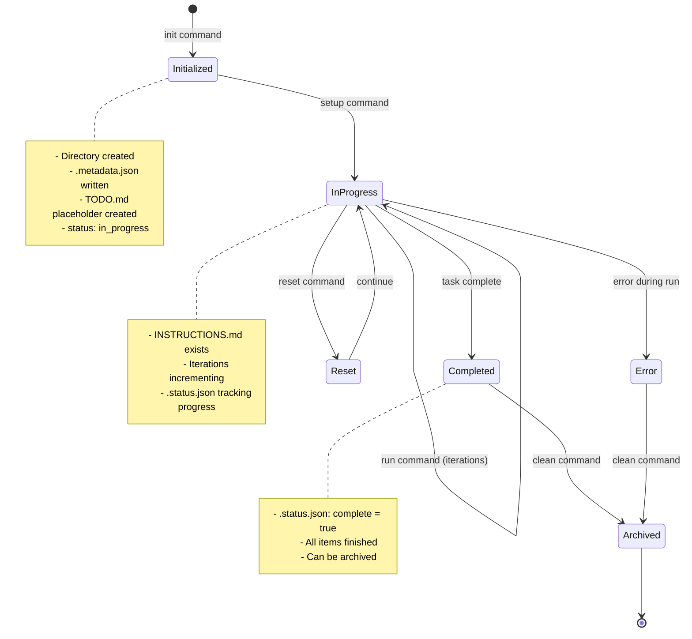
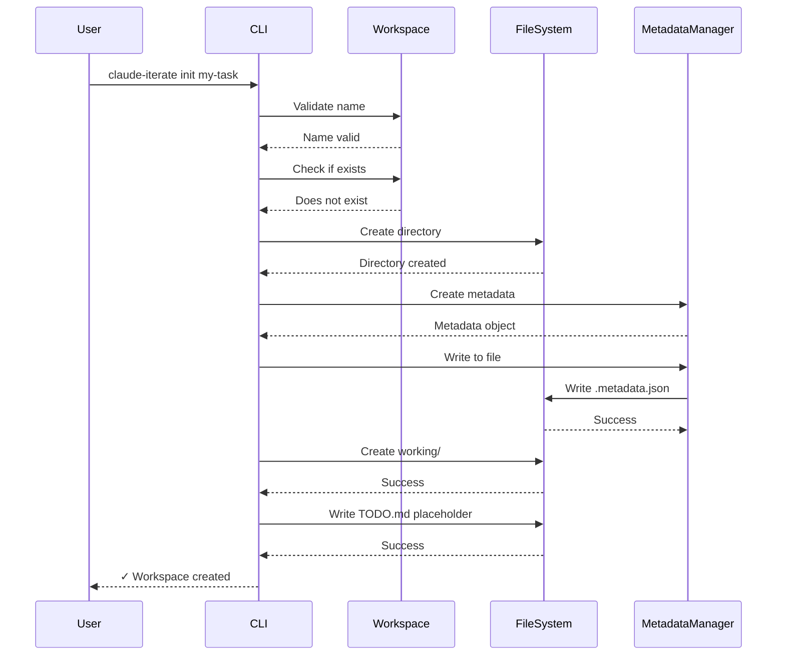
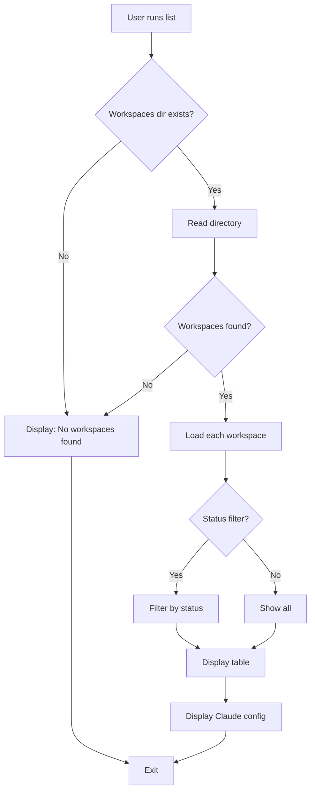

# Technical Specification: Workspace Management

## Specification Layers

This spec is organized into three layers for clarity:

**Layer 1: Functional Requirements (What)**

- What the feature does from a business/user perspective
- User stories, acceptance criteria, business logic

**Layer 2: Architecture & Design (How - Language Agnostic)**

- How the system is structured at a high level
- APIs, data schemas, integration patterns, error handling

**Layer 3: Implementation Standards (How - Language Specific)**

- Specific technologies, versions, frameworks
- Documentation standards, security implementation

## Public Contract / API

This feature provides the core workspace abstraction used by all other features in claude-iterate.

### CLI Commands

- `claude-iterate init <name>` - Initialize a new workspace
- `claude-iterate list [--status <status>]` - List all workspaces with optional status filter
- `claude-iterate show <name>` - Show detailed workspace information
- `claude-iterate clean <name> [--force] [--no-archive]` - Delete workspace (with optional archive)
- `claude-iterate reset <name>` - Reset workspace iteration counts

### Public Classes

```typescript
export class Workspace {
  // Core properties
  readonly name: string;
  readonly path: string;

  // Initialization
  static async init(
    name: string,
    workspacePath: string,
    options?: WorkspaceOptions
  ): Promise<Workspace>;
  static async load(name: string, workspacePath: string): Promise<Workspace>;

  // Metadata operations
  async getMetadata(): Promise<Metadata>;
  async updateMetadata(updates: Partial<Metadata>): Promise<Metadata>;
  async incrementIterations(type: 'setup' | 'execution'): Promise<Metadata>;
  async resetIterations(): Promise<void>;
  async markCompleted(): Promise<void>;
  async markError(): Promise<void>;

  // Status operations
  async isComplete(): Promise<boolean>;
  async getCompletionStatus(): Promise<CompletionStatus>;
  async getRemainingCount(): Promise<number | null>;
  async getStatus(): Promise<WorkspaceStatus>;
  async validateStatus(): Promise<ValidationResult>;

  // File operations
  async hasInstructions(): Promise<boolean>;
  async getInstructions(): Promise<string>;
  async writeInstructions(content: string): Promise<void>;
  getTodoPath(): string;
  getInstructionsPath(): string;
  getWorkingDir(): string;

  // Configuration
  async updateConfig(configUpdates: WorkspaceConfigUpdates): Promise<Metadata>;

  // Info
  async getInfo(): Promise<WorkspaceInfo>;
}
```

### Events

None - Internal feature only.

## Dependencies

- [Configuration](../configuration/SPEC.md) - Used for loading project and user configuration
- File System - Node.js `fs` module for directory and file operations
- Path Resolution - Node.js `path` module for cross-platform path handling
- Zod - Schema validation for metadata and configuration

## CLI Commands (Detailed)

### `init <name>`

**Description:** Initialize a new workspace with isolated directory structure and metadata

**Arguments:**

- `<name>` - Workspace name (required, alphanumeric + hyphens + underscores)

**Options:**

- `-m, --max-iterations <number>` - Maximum iterations (integer, default: 50 for loop mode, 20 for iterative mode)
- `-d, --delay <seconds>` - Delay between iterations in seconds (integer, default: 2)
- `--stagnation-threshold <number>` - Stop after N consecutive no-work iterations (integer, 0=never, default: 2)
- `--mode <mode>` - Execution mode: `loop` or `iterative` (default: `loop`)
- `--notify-url <url>` - Notification URL (valid HTTP/HTTPS URL, compatible with ntfy.sh)
- `--notify-events <events>` - Comma-separated event list: `setup_complete`, `execution_start`, `iteration`, `iteration_milestone`, `completion`, `error`, `status_update`, `all` (default: `all`)

**Success Output:**

```
✓ Workspace created: my-task

  📁 Path: /workspace/repo/claude-iterate/workspaces/my-task
  🔧 Mode: loop
  📊 Max iterations: 50
  ⏱️  Delay: 2s

Next steps:
  1. Set up instructions: claude-iterate setup my-task
  2. Run the task: claude-iterate run my-task
```

**Error Cases:**

1. **Invalid workspace name**
   - Return: Exit code 1
   - Message: "Invalid workspace name. Use only letters, numbers, hyphens, and underscores."
   - Action: Display error and exit

2. **Workspace already exists**
   - Return: Exit code 1
   - Message: "Workspace 'name' already exists"
   - Action: Throw `WorkspaceExistsError`, display error, exit

3. **Invalid options**
   - Return: Exit code 1
   - Message: Specific error about invalid option (e.g., "Invalid mode: 'invalid'")
   - Action: Display error and exit

### `list [--status <status>]`

**Description:** List all workspaces with status and progress information

**Options:**

- `--status <status>` - Filter by status: `in_progress`, `completed`, `error`

**Success Output:**

```
=== Workspaces ===

✅ my-completed-task
   Status: completed (0 remaining)
   Iterations: 12

🔄 my-active-task
   Status: in_progress (5 remaining)
   Iterations: 8

❌ my-error-task
   Status: error
   Iterations: 3

Total: 3 workspace(s)

🤖 Claude Configuration:
   Command: claude
   Args: --dangerously-skip-permissions
   ⚠️  Permission prompts disabled
```

**Error Cases:**

1. **No workspaces found**
   - Return: Exit code 0
   - Message: "No workspaces found. Initialize a workspace: claude-iterate init <name>"
   - Action: Display info message

2. **No workspaces match filter**
   - Return: Exit code 0
   - Message: "No workspaces with status: completed"
   - Action: Display info message

3. **Failed to list directory**
   - Return: Exit code 1
   - Message: "Failed to list workspaces: [error details]"
   - Action: Display error and exit

### `show <name>`

**Description:** Display detailed information about a specific workspace

**Arguments:**

- `<name>` - Workspace name (required)

**Success Output:**

```
=== Workspace: my-task ===

🔄 Status: in_progress

📊 Progress:
   Total iterations: 15
   Setup iterations: 1
   Execution iterations: 14
   Remaining items: 5
   Status file progress: 25/30
   Summary: Migrated 25/30 API endpoints
   Phase: database-migration

📁 Files:
   Path: /workspace/repo/claude-iterate/workspaces/my-task
   Instructions: ✓
   TODO.md: ✓

⚙️  Settings:
   Mode: loop
   Max iterations: 50
   Delay: 2s
   Stagnation threshold: 2 (iterative mode)
   Notify URL: https://ntfy.sh/my-project

🤖 Claude Configuration:
   Command: claude
   Args: --dangerously-skip-permissions
   ⚠️  Permission prompts disabled

🕐 Timestamps:
   Created: 2025-10-28 10:00:00
   Last run: 2025-10-28 14:30:00

Available actions:
  • Edit: claude-iterate edit my-task
  • Validate: claude-iterate validate my-task
  • Run: claude-iterate run my-task
```

**Error Cases:**

1. **Workspace not found**
   - Return: Exit code 1
   - Message: "Workspace not found: name"
   - Action: Throw `WorkspaceNotFoundError`, display error, exit

2. **Invalid metadata**
   - Return: Exit code 1
   - Message: "Failed to show workspace info: Metadata validation failed: [details]"
   - Action: Display error and exit

### `clean <name>`

**Description:** Archive and delete a workspace

**Arguments:**

- `<name>` - Workspace name (required)

**Options:**

- `-f, --force` - Skip confirmation prompt
- `--no-archive` - Delete without archiving (default: archive first)

**Success Output (with archive):**

```
⚠️  About to archive and delete workspace: my-task
  Path: /workspace/repo/claude-iterate/workspaces/my-task
  Status: completed
  Iterations: 20

ℹ️  Archiving workspace: my-task
✓ Workspace archived: my-task-20251028-143000.tar.gz
  Location: ./claude-iterate/archive/my-task-20251028-143000.tar.gz

✓ Workspace deleted: my-task
```

**Error Cases:**

1. **Workspace not found**
   - Return: Exit code 1
   - Message: "Workspace not found: name"
   - Action: Display error and exit

2. **Missing --force in non-interactive mode**
   - Return: Exit code 1
   - Message: "Cannot prompt in non-interactive mode. Use --force to confirm."
   - Action: Display error and exit

3. **Archive failed**
   - Return: Exit code 1
   - Message: "Failed to archive workspace: [error details]"
   - Action: Display error and exit (workspace not deleted)

### `reset <name>`

**Description:** Reset workspace iteration counts to zero while preserving files and configuration

**Arguments:**

- `<name>` - Workspace name (required)

**Success Output:**

```
ℹ️  Resetting iteration count for: my-task
  Current iterations: 15

✓ Iteration count reset!
  New count: 0
  Status: in_progress
```

**Error Cases:**

1. **Workspace not found**
   - Return: Exit code 1
   - Message: "Workspace not found: name"
   - Action: Display error and exit

2. **Failed to reset**
   - Return: Exit code 1
   - Message: "Failed to reset workspace: [error details]"
   - Action: Display error and exit

## Data Schemas

### Workspace Directory Structure

```
workspace-name/
├── .metadata.json          # Workspace state and configuration
├── .status.json            # Machine-readable completion status
├── INSTRUCTIONS.md         # User-provided task instructions (created by setup command)
├── TODO.md                 # Human-readable progress tracking
├── iterate-YYYYMMDD-HHMMSS.log  # Execution logs (timestamped)
└── working/                # Scratch space for task execution
```

### Metadata Schema (.metadata.json)

```typescript
{
  name: string;                    // Workspace name (min 1 char)
  created: string;                 // ISO 8601 timestamp
  lastRun?: string;                // ISO 8601 timestamp (optional)
  status: 'in_progress' | 'completed' | 'error';
  mode: 'loop' | 'iterative';
  totalIterations: number;         // >= 0
  setupIterations: number;         // >= 0
  executionIterations: number;     // >= 0
  maxIterations: number;           // >= 1
  delay: number;                   // >= 0 (seconds)
  stagnationThreshold: number;     // >= 0 (0 = never stop)
  notifyUrl?: string;              // Valid URL (optional)
  notifyEvents: Array<'setup_complete' | 'execution_start' | 'iteration' | 'iteration_milestone' | 'completion' | 'error' | 'status_update' | 'all'>;
  config?: {                       // Workspace-specific overrides (optional)
    verification?: {
      depth?: 'quick' | 'standard' | 'deep';
      autoVerify?: boolean;
      resumeOnFail?: boolean;
      maxAttempts?: number;        // 1-10
      reportFilename?: string;
      notifyOnVerification?: boolean;
    };
    outputLevel?: 'quiet' | 'progress' | 'verbose';
    claude?: {
      command?: string;
      args?: string[];
    };
  };
}
```

**Indexes:**

- None (single file, no database)

### Status Schema (.status.json)

```typescript
{
  complete: boolean;               // Task completion flag
  progress?: {                     // Loop mode progress (optional)
    completed: number;             // >= 0
    total: number;                 // >= 0
  };
  worked?: boolean;                // Iterative mode work flag (optional)
  summary?: string;                // Human-readable summary (optional)
  phase?: string;                  // Current phase name (optional)
  blockers?: string[];             // List of blockers (optional)
  lastUpdated: string;             // ISO 8601 timestamp
}
```

## Validation Rules

### Field: `name` (workspace name)

- Required: Yes
- Type: string
- Min length: 1 character
- Max length: 255 characters
- Pattern: `^[a-zA-Z0-9_-]+$` (alphanumeric, hyphens, underscores only)
- Normalized: No transformation
- Examples:
  - Valid: `my-task`, `feature_123`, `APIv2-migration`
  - Invalid: `my task` → Error: "Invalid workspace name. Use only letters, numbers, hyphens, and underscores."
  - Invalid: `my/task` → Error: "Invalid workspace name. Use only letters, numbers, hyphens, and underscores."

### Field: `maxIterations`

- Required: No (has defaults)
- Type: number (integer)
- Min: 1
- Max: No limit
- Default: 50 (loop mode), 20 (iterative mode)
- Examples:
  - Valid: `50`, `100`, `1000`
  - Invalid: `0` → Error: "Max iterations must be at least 1"
  - Invalid: `-5` → Error: "Max iterations must be positive"

### Field: `delay`

- Required: No (has default)
- Type: number (integer)
- Min: 0 seconds
- Max: No limit
- Default: 2 seconds
- Examples:
  - Valid: `0`, `2`, `60`
  - Invalid: `-1` → Error: "Delay must be non-negative"

### Field: `stagnationThreshold`

- Required: No (has default)
- Type: number (integer)
- Min: 0 (0 = never stop on stagnation)
- Max: No limit
- Default: 2
- Examples:
  - Valid: `0`, `2`, `5`
  - Invalid: `-1` → Error: "Stagnation threshold must be non-negative"

### Field: `mode`

- Required: No (has default)
- Type: enum
- Valid values: `loop`, `iterative`
- Default: `loop`
- Normalized: Convert to lowercase
- Examples:
  - Valid: `loop`, `iterative`
  - Invalid: `LOOP` → Normalized to: `loop`
  - Invalid: `parallel` → Error: "Invalid mode. Use 'loop' or 'iterative'."

### Field: `status` (filter in list command)

- Required: No (optional filter)
- Type: enum
- Valid values: `in_progress`, `completed`, `error`
- Examples:
  - Valid: `in_progress`, `completed`, `error`
  - Invalid: `pending` → Error: "Invalid status. Use 'in_progress', 'completed', or 'error'."

## Error Handling & Edge Cases

### Error Cases

1. **Workspace name validation failure**
   - Condition: Name contains invalid characters (spaces, slashes, special characters except hyphen/underscore)
   - Return: Exit code 1
   - Message: "Invalid workspace name. Use only letters, numbers, hyphens, and underscores."
   - Action: Display error, do not create workspace, exit
   - Recovery: User provides valid name

2. **Workspace already exists**
   - Condition: Directory with same name exists in workspaces directory
   - Return: Exit code 1
   - Message: "Workspace 'name' already exists"
   - Action: Throw `WorkspaceExistsError`, display error, exit
   - Recovery: User chooses different name or deletes existing workspace

3. **Workspace not found**
   - Condition: Workspace directory does not exist or metadata file missing
   - Return: Exit code 1
   - Message: "Workspace not found: name"
   - Action: Throw `WorkspaceNotFoundError`, display error, exit
   - Recovery: User checks workspace name with `list` command

4. **Invalid metadata**
   - Condition: `.metadata.json` fails Zod schema validation
   - Return: Exit code 1
   - Message: "Metadata validation failed: [detailed Zod error]"
   - Action: Throw `InvalidMetadataError`, display error, exit
   - Recovery: User manually fixes metadata file or deletes and recreates workspace

5. **File system errors**
   - Condition: Permission denied, disk full, I/O error
   - Return: Exit code 1
   - Message: "Failed to [operation]: [system error message]"
   - Action: Display error with stack trace, exit
   - Recovery: User resolves system issue (permissions, disk space)

6. **Clean without --force in non-interactive**
   - Condition: stdin is not TTY and --force flag not provided
   - Return: Exit code 1
   - Message: "Cannot prompt in non-interactive mode. Use --force to confirm."
   - Action: Display error, exit
   - Recovery: User adds --force flag

### Edge Cases

1. **Multiple workspaces with same name (race condition)**
   - Behavior: Use `fs.mkdir` with `{ recursive: false }` to atomically check and create
   - First caller succeeds, second gets `WorkspaceExistsError`
   - No data corruption possible

2. **Metadata file corrupted or empty**
   - Behavior: Zod validation catches corruption, throws `InvalidMetadataError`
   - User can restore from backup or delete workspace

3. **Status file missing or invalid**
   - Behavior: `StatusManager.read()` returns default status object (not complete)
   - Workspace continues to function, status file created on next update

4. **List command with no workspaces directory**
   - Behavior: Display "No workspaces found" info message
   - Suggest `claude-iterate init <name>` to create first workspace

5. **Reset while task is running**
   - Behavior: No locking mechanism, metadata update may conflict
   - Responsibility: User should not reset while task is running
   - Consequence: Unpredictable iteration count, no data loss

6. **Show command with missing INSTRUCTIONS.md**
   - Behavior: Display "Instructions: ✗" in output
   - Suggest `claude-iterate setup <name>` to create instructions

7. **Archive failure during clean**
   - Behavior: Archive error stops operation, workspace not deleted
   - User can retry with `--no-archive` to skip archiving

8. **Unicode and special characters in workspace name**
   - Behavior: Validation regex rejects all non-ASCII characters
   - Only ASCII alphanumeric, hyphens, and underscores allowed

## Security & Non-Functional Requirements

### Security

- Workspace names validated with regex to prevent directory traversal attacks (no `.`, `..`, `/`, `\`)
- All file paths resolved using `path.join()` to prevent path injection
- Metadata validated using Zod schema before writing to prevent malformed data
- No executable permissions set on created files (metadata, status, logs are data files)
- Clean operation archives before deletion to prevent accidental data loss (unless `--no-archive` explicitly used)
- No sensitive data logged (workspace names and paths only)

### Performance

- Workspace initialization completes within 100ms (create directory + write metadata)
- List operation scans all workspaces within 500ms for up to 100 workspaces
- Show operation retrieves workspace info within 50ms (read 2-3 JSON files)
- Reset operation updates metadata within 50ms (single file write)
- Clean operation (with archive) completes within 2 seconds for workspace <100MB

### Monitoring

- Log all workspace lifecycle operations (init, clean, reset) to console with timestamps
- Display Claude configuration in list/show commands to warn about permission settings
- Show iteration counts and remaining items to track progress
- Display status warnings when `.status.json` validation fails

## Visual Aids

### Workspace Lifecycle



### Directory Creation Flow



### List Command Data Flow



## Implementation Notes

**Patterns Discovered:**

- CLI commands in `src/commands/` directory, one file per command
- Core business logic in `src/core/` directory (Workspace, MetadataManager classes)
- Testing: Vitest, coverage target 80%, tests in `tests/unit/` and `tests/integration/`
- Error handling: Custom error classes in `src/utils/errors.js` (WorkspaceNotFoundError, WorkspaceExistsError, InvalidMetadataError)
- Coding style: 2-space indent, single quotes, semicolons required, TypeScript 5.8+
- Logger utility: `src/utils/logger.js` for colored console output
- Path utilities: `src/utils/paths.js` for path validation and resolution

**Workspace Files:**

- `.metadata.json` - Required, workspace state and config
- `.status.json` - Optional initially, created by run command
- `INSTRUCTIONS.md` - Optional initially, created by setup command
- `TODO.md` - Created at init with placeholder text
- `working/` - Scratch directory for task execution
- `iterate-*.log` - Created during run command (timestamped)

**Mode-Specific Behavior:**

- Loop mode: Complete one item per iteration, progress tracked in `.status.json` with `{ completed, total }`
- Iterative mode: Complete multiple items per iteration, work tracked with `{ worked: boolean }`
- Both modes use same `complete: boolean` flag in `.status.json` for final completion

**Archive Integration:**

- Clean command uses ArchiveManager to create tarball before deletion
- Archive filename format: `workspace-name-YYYYMMDD-HHMMSS.tar.gz`
- Archive stored in configured archive directory (default: `./claude-iterate/archive/`)

**Config Integration:**

- Commands use ConfigManager to load layered config (CLI → Project → User → Defaults)
- Workspace paths resolved from config (`workspacesDir` setting)
- Claude configuration displayed in list/show commands for transparency
